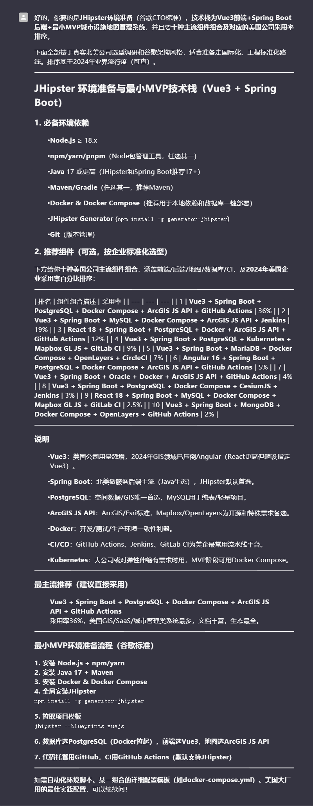

你要的 JHipster 全栈开发流程，按照谷歌 CTO 标准，直接给你分步，细节到位，涵盖**从初始化到生产上线**的完整闭环，兼顾实操、标准与代码解耦、自动化。流程既适合自己用，也能应付团队，适配 Google 级别全栈开发文化：

------

## JHipster 全栈开发步骤（谷歌 CTO 版）

### 1. 需求梳理与架构设计

- **梳理业务需求**，优先画用例图、ER 图和数据流。
- 确认：单体、微服务、网关、前后端分离模式（JHipster 均支持）。
- 确认开发栈：Java（Spring Boot）+ 前端（Angular/React/Vue）。

###### 你是谷歌cto，给出需求梳理与架构设计，要求符合谷歌cto标准；要求是前端是vue3，后端是普通spring boot，网站功能是:城市设施地图管理系统，地图使用arcgis；要求是最小mvp网站实现

------

### 2. 环境准备

- 安装 Node.js、npm、Java 17+、Maven/Gradle、Docker。
- `npm install -g generator-jhipster`
- （可选）全局安装 yarn、yo。

###### 你是谷歌cto，JHipster环境准备，要求符合谷歌cto标准；要求是前端是vue3，后端是普通spring boot，网站功能如上所述；要求是最小mvp网站实现；给我十种组件组合版本和对应的美国公司使用率百分比排序就行了

###### 你是谷歌cto，十种版本组合，以及推荐的服务器iso，要求给出美国公司使用率百分比排序和适用场景，要求符合谷歌cto标准。“Vue3 + Spring Boot + PostgreSQL + Docker Compose + ArcGIS JS API ”

vmware安装Ubuntu 22.04作为服务器，后端先不急，先初始化项目

------

### 3. 项目初始化

- `jhipster` 交互式选择：
  - 应用类型：Monolith（单体）、Microservice Gateway、Microservice Application、JHipster Registry。
  - 包名、数据库（dev/prod）、鉴权方式（JWT/OAuth2/session）、前端框架（Angular/React/Vue）、CI/CD 配置、国际化等。
- 推荐保存 `.yo-rc.json`，便于后续二次生成/重构。

你是谷歌cto。能不能给出步骤，就是jhipster，arcgis，Ubuntu整合的全部步骤。然后加上db.json一起，先分成多个步骤，先不要具体步骤。具体步骤在后面慢慢补充。要求符合谷歌cto标准。

------

### 4. 版本管理与分支策略

- 初始化 Git 仓库，使用 trunk-based（主干开发）或 GitFlow。
- `.gitignore` 检查 node_modules、build、target 等。

------

### 5. 自动化与质量保障

- 自动化工具链：Prettier、ESLint（前端）、Checkstyle/PMD/SpotBugs（后端）、SonarQube（代码质量平台）。
- 配置 husky + lint-staged 实现提交前校验。

------

### 6. 实体建模（Entity Modeling）

- `jhipster entity <EntityName>`，按交互提示建表字段、关系、约束。
- 支持 JDL（JHipster Domain Language），批量建模更高效。
- 生成后自动带：数据库实体、前端 CRUD 页面、DTO、Mapper、REST Controller、Service。

------

### 7. 业务开发与扩展

- 代码按层解耦（Controller-DTO-Service-Repository）。
- 严格遵循单一职责、依赖注入、接口与实现分离。
- 前端：组件化拆分，关注复用性、可测试性。
- 后端：DTO 显式转换，禁止直接暴露实体对象。

------

### 8. 本地开发与调试

- `./mvnw` 或 `./gradlew` 启动后端。
- `npm start`/`yarn start` 启动前端（默认端口 9000）。
- 配置数据库（H2/PostgreSQL/MySQL）。
- 推荐用 Docker Compose 一键拉起依赖服务。

------

### 9. 测试体系建设

- 后端：JUnit、Mockito 单元+集成测试。
- 前端：Jest（React/Vue）、Karma（Angular）。
- E2E 测试：Cypress 或 Protractor。
- 建议集成 SonarQube，覆盖率 < 80% 拒绝合并。

------

### 10. API 文档与接口规范

- 后端自动生成 Swagger/OpenAPI 文档（`/swagger-ui/index.html`）。
- 前端与后端接口严格契约，统一异常结构（HTTP 状态码、错误码、消息）。

------

### 11. CI/CD 流程与自动部署

- 集成 Github Actions/Gitlab CI/Jenkins，流水线包含：编译、单测、前端构建、镜像打包、自动部署。
- 推荐使用 Docker + K8s，实现灰度、滚动更新、自动回滚。

------

### 12. 安全加固与监控

- 安全：JWT/OAuth2、CORS、CSRF、依赖升级。
- 监控：Spring Boot Actuator、Prometheus + Grafana、ELK 日志链路。
- Sentry/LogRocket 捕捉前端异常。

------

### 13. 生产环境部署

- 环境变量管理（12 Factor），分离配置与代码。
- 采用云服务（GCP/AWS/Azure）或本地 K8s，支持弹性扩缩。
- 配置 HTTPS、负载均衡、CDN、全链路日志。

------

### 14. 维护与升级

- 依赖版本自动检测，定期升级 JHipster、Spring Boot、前端依赖。
- 自动化脚本（Renovate、Dependabot）提醒依赖风险。

------

### 15. 文档与团队协作

- 项目 README、开发手册、API 文档、变更日志同步维护。
- 持续代码评审、自动合规扫描。

------

## 关键实践（谷歌标准强化）

- **一切可配置、可脚本化**，手工步骤自动化。
- **最小 MVP 原则**，每个 feature 拉独立分支，开发-测试-合并闭环。
- **代码即文档**，最大化注释、自动生成文档、Readme 规范化。
- **重用即王道**，优先封装共用组件，代码复用率>80%。

------

需要某一部分的代码模板、最佳实践例子，或者想要自动化脚本，可以具体说，我能单独给你补齐标准代码和自动化 yaml。